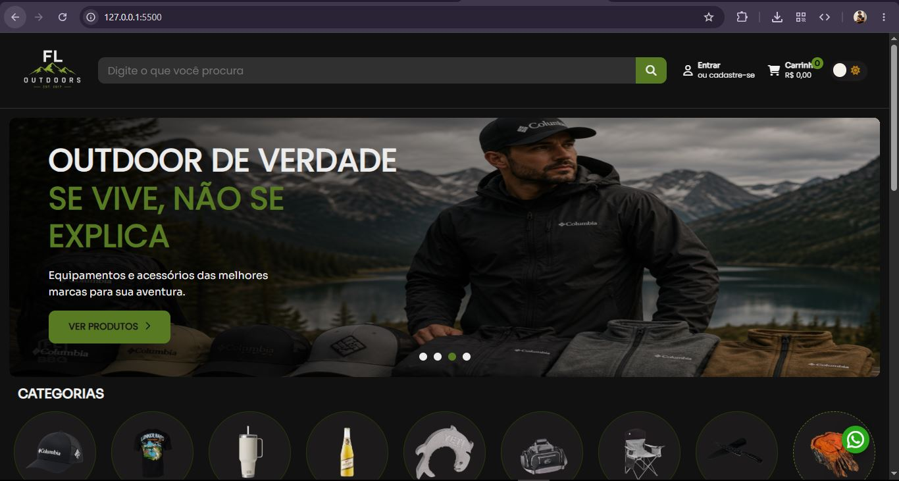

<div align="center">

# 🏕️ FL Outdoors

### Uma experiência moderna para o comércio Outdoor

<p align="center">
  
</p>

<p align="center">


</p>

</div>

---

# 📖 Sobre o Projeto

O **FL Outdoors** é um projeto de desenvolvimento de um e-commerce moderno criado para substituir e evoluir o site atual da empresa, oferecendo uma experiência mais rápida, organizada e intuitiva para seus clientes.

Mais do que uma simples reformulação visual, o projeto foi planejado para possuir uma arquitetura escalável, separando completamente o Front-end do Back-end. Essa abordagem permitirá maior liberdade para futuras implementações, melhor manutenção do código e integração com diferentes serviços.

Atualmente o projeto encontra-se em desenvolvimento e representa uma das principais iniciativas de estudo e evolução profissional da **João Filipe**, colocando em prática conceitos modernos de desenvolvimento Web enquanto um sistema real é construído.

---

# ✨ História do Projeto

O projeto nasceu no início de **2026** como um projeto de estudos em **JavaScript**.

Na época, meu principal objetivo era evoluir meus conhecimentos em desenvolvimento Front-end e aprender como funcionava a construção de aplicações Web mais completas.

Durante esse período surgiu uma conversa com o proprietário da empresa onde trabalho sobre a necessidade de modernizar seu site institucional e sua loja virtual.

A partir dessa ideia, nasceu o projeto **FLBBQ**, inicialmente desenvolvido apenas como um estudo utilizando HTML, CSS e JavaScript.

A proposta inicial consistia em reproduzir um e-commerce moderno enquanto colocava em prática todos os conceitos estudados durante o curso de JavaScript.

Conforme o projeto evoluía, novas necessidades começaram a surgir.

A empresa passou a expandir seu catálogo de produtos e deixou de atuar apenas com artigos para pesca e churrasco.

Com isso surgiu uma nova estratégia de posicionamento da marca, fazendo com que o projeto também precisasse evoluir.

No início da **Versão 2**, em **Julho de 2026**, iniciou-se a migração da identidade visual para **FL Outdoors**, uma marca mais abrangente e preparada para representar o universo Outdoor como um todo.

Essa mudança exigiu praticamente um replanejamento completo da interface criada anteriormente.

Diversos componentes foram reconstruídos, novas páginas começaram a ser desenvolvidas e toda a arquitetura do projeto passou a ser pensada para permitir crescimento contínuo.

Hoje o projeto deixou de ser apenas um estudo.

Ele se tornou uma aplicação real em constante evolução, desenvolvida enquanto novos conhecimentos são adquiridos diariamente.

Cada funcionalidade implementada representa também um novo aprendizado durante minha jornada como desenvolvedor.

---

# 🎯 Objetivos

O principal objetivo do projeto é desenvolver um e-commerce moderno, intuitivo e profissional capaz de substituir o site atual da empresa.

Além disso, o projeto busca proporcionar uma experiência muito superior à encontrada em marketplaces tradicionais.

Entre seus principais objetivos estão:

- Desenvolver uma interface moderna e responsiva;
- Destacar os principais produtos importados da empresa;
- Melhorar a experiência de navegação dos clientes;
- Fortalecer a identidade visual da marca;
- Aplicar conceitos modernos de desenvolvimento Web;
- Construir uma arquitetura preparada para futuras expansões;
- Facilitar futuras integrações com APIs e serviços externos;
- Criar um projeto profissional para portfólio e evolução técnica.

---

# 🌎 Sobre a Empresa

A empresa atualmente atua no segmento de produtos Outdoor, oferecendo itens importados de alta qualidade para diferentes públicos.

Seu catálogo reúne equipamentos para pesca, camping, aventura, vestuário, acessórios, utilidades e diversos outros produtos voltados ao universo Outdoor.

Atualmente suas vendas acontecem principalmente através dos seguintes marketplaces:

- Mercado Livre
- Amazon
- Shopee
- Magazine Luiza

Além do site oficial:

> https://flbbq.com.br

O projeto FL Outdoors nasce justamente para oferecer uma experiência própria, moderna e personalizada, fortalecendo ainda mais a presença digital da empresa.

---

# 💡 Filosofia do Projeto

Este projeto foi desenvolvido seguindo alguns princípios fundamentais.

## 🎨 Design moderno

Criar uma interface limpa, agradável e intuitiva.

---

## ⚡ Performance

Reduzir carregamentos desnecessários e oferecer uma navegação rápida.

---

## 📱 Responsividade

Preparar toda a aplicação para funcionar corretamente em diferentes tamanhos de tela.

---

## ♻️ Reutilização

Desenvolver componentes reutilizáveis para facilitar manutenção e futuras expansões.

---

## 📈 Escalabilidade

Organizar o projeto pensando em crescimento contínuo.

---

## 🔒 Organização

Separar responsabilidades entre páginas, componentes e futuras integrações.

---

# 🖼️ Preview

Em breve serão adicionadas capturas de tela mostrando a evolução do projeto.

## Home

```text
docs/images/home.png
```

---

## Página do Produto

```text
docs/images/produto.png
```

---

## Categorias

```text
docs/images/categorias.png
```

---

## Login

```text
docs/images/login.png
```

---

## Cadastro

```text
docs/images/cadastro.png
```

---

## Página 404

```text
docs/images/404.png
```

---

# 🚀 Tecnologias Utilizadas

## Front-end

- HTML5
- CSS3
- JavaScript (ES6+)

---

## Back-end *(Em desenvolvimento)*

- Node.js
- Express.js
- CORS

---

## Comunicação

- Fetch API
- JSON

---

## Versionamento

- Git
- GitHub

---

## Hospedagem

### Front-end

- Vercel *(Planejado)*

### API

- •••••• *(Planejado)*

---

# 🧰 Ferramentas Utilizadas

| Ferramenta | Finalidade |
|------------|------------|
| Visual Studio Code | Desenvolvimento do projeto |
| Git | Controle de versão |
| GitHub | Hospedagem do código-fonte |
| Paint.NET | Criação e edição de imagens |
| ChatGPT | Apoio técnico, documentação e desenvolvimento |

---

# 🎯 Público-Alvo

O projeto foi pensado para atender pessoas apaixonadas pelo universo Outdoor.

Entre os principais públicos estão:

- Pescadores;
- Campistas;
- Aventureiros;
- Praticantes de esportes ao ar livre;
- Colecionadores de produtos importados;
- Consumidores que buscam produtos exclusivos.

O objetivo é oferecer uma experiência simples, organizada e agradável para clientes de todas as idades.

---

# 🎨 Identidade Visual

A identidade visual foi planejada para transmitir:

- Exclusividade;
- Qualidade;
- Confiança;
- Aventura;
- Modernidade;
- Organização;
- Facilidade de navegação.

Todas as escolhas de cores, componentes e estrutura da interface seguem esses princípios para fortalecer a presença digital da empresa.

---

➡️ **Continua na Parte 2**, onde serão apresentados a arquitetura do projeto, funcionalidades, estrutura de pastas, roadmap completo, evolução das versões V1 até V5, aprendizados e o status atual do desenvolvimento.

Essa organização facilita a escalabilidade do projeto, tornando futuras implementações muito mais simples.

---

# 🚀 Funcionalidades

## ✅ Implementadas

- Header responsivo
- Banner principal
- Seção de categorias
- Destaques da loja
- Marcas parceiras
- Footer
- Página inicial
- Página de produto
- Página de login
- Página de categorias
- Página de pesquisa
- Página 404
- Componentes reutilizáveis
- Estrutura modular
- Consumo inicial da API
- Organização por componentes

---

## 🚧 Em desenvolvimento

- Página de cadastro
- Integração completa com a API
- Sistema de filtros
- Produtos relacionados
- Responsividade completa
- Melhorias de UX
- Otimização de performance
- Melhorias nas animações

---

## 🔮 Planejadas

- Favoritos
- Carrinho inteligente
- Mini carrinho
- Histórico de pesquisa
- Busca dinâmica
- Sistema de promoções
- Produtos vistos recentemente
- Avaliações
- Compartilhamento de produtos
- Tema escuro

---

# 🛣️ Roadmap Oficial

## ✅ V1 — Layout Base (100%)

### Objetivo

Criar toda a identidade visual da aplicação.

### Desenvolvido

- Layout inicial
- Banner
- Header
- Footer
- Marcas
- Produtos
- Paleta de cores
- Design inicial
- Estrutura HTML
- CSS da aplicação

### Status

✅ Concluído

---

## 🚧 V2 — Loja Navegável (80%)

Após a conclusão da primeira versão, surgiu uma importante mudança de planejamento.

Durante o desenvolvimento, a empresa iniciou um processo de reposicionamento da marca, deixando de atuar exclusivamente com produtos para pesca e churrasco e ampliando seu catálogo para o segmento Outdoor.

Essa decisão impactou diretamente o projeto.

A identidade visual precisou ser revisada e diversas telas foram reestruturadas para acompanhar a nova proposta da empresa.

Nesta versão o projeto passou a deixar de ser apenas um layout para se tornar uma aplicação navegável.

### Principais evoluções

- Página de Produto
- Página Login
- Página Cadastro
- Página Categorias
- Pesquisa
- Página 404
- Componentização
- Estrutura profissional
- Integração inicial com API
- Melhor organização do código

### Status

🟨 Em desenvolvimento (80%)

---

## 🚧 V3 — Backend + API Própria (30%)

A terceira versão representa o início da integração entre Front-end e Back-end.

Nesta etapa está sendo desenvolvida uma API própria utilizando Node.js.

O objetivo é centralizar todas as requisições realizadas pela aplicação, permitindo maior controle dos dados, segurança e facilidade para futuras integrações.

### Tecnologias

- Node.js
- Express.js
- JavaScript
- JSON
- Fetch API
- CORS

### Funcionalidades atuais

- Listagem de produtos
- Listagem de categorias
- Organização das rotas
- Estrutura inicial da API

### Próximas implementações

- Filtros
- Marcas
- Estoque
- Preços
- Produtos relacionados

### Status

🟨 Em desenvolvimento (30%)

---

## ⬜ V4 — Integração Completa

### Objetivos

- API totalmente funcional
- Consumo dos dados reais
- Melhorias de segurança
- Cache
- Organização completa da arquitetura
- Deploy da API

### Status

⬜ Não iniciado

---

## ⬜ V5 — Produção

A última etapa do projeto representa a versão que será utilizada pela empresa.

Todo o sistema estará integrado e preparado para utilização em ambiente real.

### Objetivos

- Sistema completo
- Integração total
- Performance otimizada
- Responsividade completa
- Publicação oficial
- Melhorias contínuas

### Status

⬜ Não iniciado

---

# 📊 Status Geral do Desenvolvimento

| Versão | Nome | Progresso |
|---------|------|----------:|
| ✅ V1 | Layout Base | **100%** |
| 🟨 V2 | Loja Navegável | **80%** |
| 🟨 V3 | API Própria | **30%** |
| ⬜ V4 | Integração Completa | **0%** |
| ⬜ V5 | Produção | **0%** |

---

# 📚 Aprendizados Durante o Projeto

O desenvolvimento da FL Outdoors representa muito mais do que a criação de um e-commerce.

Cada nova funcionalidade implementada exigiu novos estudos e pesquisas, tornando este projeto uma importante etapa da minha evolução como desenvolvedor.

## Tecnologias e conceitos estudados

- ✅ HTML5 Semântico
- ✅ CSS3 Moderno
- ✅ Flexbox
- ✅ Grid Layout
- ✅ Responsividade
- ✅ JavaScript ES6+
- ✅ Manipulação do DOM
- ✅ ES Modules
- ✅ Promises
- ✅ Fetch API
- ✅ JSON
- ✅ Consumo de APIs REST
- ✅ Organização de código
- ✅ Componentização
- ✅ Git
- ✅ GitHub
- ✅ Node.js
- ✅ Express.js
- ✅ CORS
- 🟨 Arquitetura cliente-servidor
- 🟨 Integração Front-end + Back-end
- ⬜ Deploy em produção
- ⬜ Integração completa com Loja Integrada

---

# 💻 Desafios do Projeto

Durante o desenvolvimento diversos desafios surgiram.

Os principais foram:

- Evoluir do HTML estático para uma aplicação dinâmica;
- Reestruturar a interface após a mudança da marca;
- Criar componentes reutilizáveis;
- Organizar uma arquitetura escalável;
- Desenvolver simultaneamente enquanto estudava novas tecnologias;
- Integrar Front-end e Back-end sem interromper o desenvolvimento da interface.

Cada obstáculo superado contribuiu diretamente para meu crescimento técnico e para a evolução do projeto.

---

# 🔮 Próximas Atualizações

As próximas versões deverão adicionar diversos recursos importantes.

Entre eles:

- Sistema completo de autenticação;
- Integração total com a API própria;
- Produtos carregados dinamicamente;
- Sistema avançado de filtros;
- Carrinho inteligente;
- Favoritos;
- Mini carrinho;
- Melhorias de SEO;
- Performance otimizada;
- Responsividade para todos os dispositivos;
- Deploy da versão oficial.

---

# 📸 Galeria do Projeto

Abaixo estão algumas capturas de tela do desenvolvimento da aplicação.

> **Obs.:** As imagens serão atualizadas conforme novas funcionalidades forem sendo implementadas.

---

## 🏠 Página Inicial

<p align="center">
    
</p>

---

## 📦 Página do Produto

<p align="center">
    
</p>

---

## 📂 Página de Categorias

<p align="center">
    
</p>

---

## 🔍 Página de Pesquisa

<p align="center">
    
</p>

---

## 🔐 Login

<p align="center">
    
</p>

---

## 👤 Cadastro

<p align="center">
    
</p>

---

## ❌ Página 404

<p align="center">
    
</p>

---

# 🎥 Demonstração

Em breve será disponibilizado um GIF demonstrando toda a navegação da aplicação.

```text
docs/gif/demo.gif
```

---

# ⚙️ Como Executar o Projeto

## 1️⃣ Clone o repositório

```bash
git clone https://github.com/SEU-USUARIO/FL-Outdoors.git
```

---

## 2️⃣ Entre na pasta

```bash
cd FL-Outdoors
```

---

## 3️⃣ Abra o projeto

Abra a pasta utilizando o **Visual Studio Code**.

---

## 4️⃣ Execute o Front-end

Utilize uma extensão como **Live Server** para iniciar a aplicação.

Ou simplesmente abra o arquivo:

```text
index.html
```

---

# 🌎 Compatibilidade

O projeto está sendo desenvolvido para funcionar corretamente nos principais navegadores modernos.

- ✅ Google Chrome
- ✅ Microsoft Edge
- ✅ Mozilla Firefox
- ✅ Opera

Em versões futuras também será otimizado para dispositivos móveis.

---

# 📈 Evolução do Projeto

```text
2026
│
├── 💡 Ideia do Projeto
│
├── 📚 Estudos em JavaScript
│
├── 🏕️ Criação da FLBBQ
│
├── 🎨 Desenvolvimento da V1
│
├── 🚀 Início da V2
│
├── 🔄 Mudança da identidade para FL Outdoors
│
├── 🧩 Componentização do Front-end
│
├── 🌐 Integração inicial com API
│
├── ⚙️ Desenvolvimento do Back-end
│
├── 🔗 Integração completa (Planejado)
│
└── 🚀 Publicação da versão oficial
```

---

# 🎯 Objetivos Futuros

Este projeto continuará evoluindo continuamente.

Algumas metas planejadas são:

- Melhorar continuamente a experiência do usuário;
- Finalizar toda a responsividade;
- Finalizar a API própria;
- Integrar completamente com a Loja Integrada;
- Melhorar SEO;
- Melhorar acessibilidade;
- Otimizar desempenho;
- Adicionar novas funcionalidades;
- Tornar o código cada vez mais organizado e escalável.

---

# 🤝 Contribuição

Atualmente este projeto está sendo desenvolvido exclusivamente por **João Filipe**.

Sugestões, feedbacks e ideias sempre serão bem-vindos.

---

# 📄 Licença

Este projeto possui uma licença proprietária.

Todo o código-fonte disponibilizado neste repositório é destinado exclusivamente para fins de estudo e demonstração do desenvolvimento do projeto.

A API utilizada pela aplicação não será disponibilizada publicamente.

Para mais informações consulte o arquivo:

```text
LICENSE.md
```

---

# 👨‍💻 Desenvolvedor

<div align="center">

## João Filipe Leandro dos Santos

Desenvolvedor Web

</div>

Apaixonado por tecnologias Web, interfaces modernas e soluções digitais.

Este projeto representa minha evolução prática durante os estudos de JavaScript, arquitetura de aplicações Web e desenvolvimento de sistemas reais.

Meu objetivo é desenvolver aplicações modernas, escaláveis e de alta qualidade, sempre buscando aprimorar minhas habilidades e aplicar boas práticas de programação.

---

# ⭐ Acompanhe a evolução

Este repositório será atualizado constantemente conforme novas funcionalidades forem sendo desenvolvidas.

Cada commit representa uma nova etapa da evolução do projeto.

Caso tenha interesse em acompanhar o desenvolvimento, fique à vontade para deixar uma ⭐ no repositório.

---

<div align="center">

# 🏕️ FL Outdoors

### Desenvolvido com dedicação, aprendizado e muita evolução.

**Projeto iniciado em 2026**

---

**© 2026 FLipeCode — Todos os direitos reservados.**

</div>